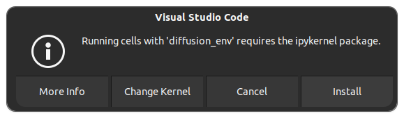

# Diffusion from scratch


[](https://github.com/psf/black)
[](https://opensource.org/licenses/MIT)

<pre>
 _(`-')     _                                       (`-').->  _                <-. (`-')_      (`-').->             (`-')  (`-')  _ (`-')               (`-').->
( (OO ).-> (_)       <-.        <-.          .->    ( OO)_   (_)         .->      \( OO) )     ( OO)_   _        <-.(OO )  (OO ).-/ ( OO).->  _         (OO )__ 
 \    .'_  ,-(`-')(`-')-----.(`-')-----.,--.(,--.  (_)--\_)  ,-(`-')(`-')----. ,--./ ,--/     (_)--\_)  \-,-----.,------,) / ,---.  /    '._  \-,-----.,--. ,'-'
 '`'-..__) | ( OO)(OO|(_\---'(OO|(_\---'|  | |(`-')/    _ /  | ( OO)( OO).-.  '|   \ |  |     /    _ /   |  .--./|   /`. ' | \ /`.\ |'--...__) |  .--./|  | |  |
 |  |  ' | |  |  ) / |  '--.  / |  '--. |  | |(OO )\_..`--.  |  |  )( _) | |  ||  . '|  |)    \_..`--.  /_) (`-')|  |_.' | '-'|_.' |`--.  .--'/_) (`-')|  `-'  |
 |  |  / :(|  |_/  \_)  .--'  \_)  .--' |  | | |  \.-._)   \(|  |_/  \|  |)|  ||  |\    |     .-._)   \ ||  |OO )|  .   .'(|  .-.  |   |  |   ||  |OO )|  .-.  |
 |  '-'  / |  |'->  `|  |_)    `|  |_)  \  '-'(_ .'\       / |  |'->  '  '-'  '|  | \   |     \       /(_'  '--'\|  |\  \  |  | |  |   |  |  (_'  '--'\|  | |  |
 `------'  `--'      `--'       `--'     `-----'    `-----'  `--'      `-----' `--'  `--'      `-----'    `-----'`--' '--' `--' `--'   `--'     `-----'`--' `--'
</pre>

## :memo: Project Overview

Implementing a **conditioned Denoising Diffsuion Probabilistic Model** (DDPM) on Tensorflow from Scratch for **Pokémon generation** and understanding the theory behind it. In order to achieve it, the Pokemon sprite images dataset from Kaggle will be used: [Pokémon sprite images](https://www.kaggle.com/datasets/yehongjiang/pokemon-sprites-images) with license: .

This project has been developed for my **Bachelor's Thesis** in **Data Science and Artificial Intelligence** at Universidad Politécnica de Madrid (UPM).

<div style=\"text-align:center\">

</div>

## :package: Structure

The **structure** of the repository is as follows:

```tree
 📦DiffusionScratch
 ┣━ 📂data
 ┃ ┣━ 📂interim
 ┃ ┃ ┣━ 📜image_paths.json
 ┃ ┃ ┣━ 📜pokedex_cleaned.csv
 ┃ ┃ ┗━ 📜pokemon_dict_dataset.json
 ┃ ┣━ 📂processed
 ┃ ┃ ┗━ 📂pokemon_tf_dataset
 ┃ ┗━ 📂raw
 ┃ ┃ ┣━ 📂sprites
 ┃ ┃ ┗━ 📜pokedex.csv
 ┣━ 📂docs
 ┃ ┣━ 📂papers
 ┃ ┗━ 📂study
 ┣━ 📂figures
 ┃ ┣━ 📂model_results_figures
 ┃ ┣━ 📂notebook_figures
 ┃ ┗━ 📂readme_figures
 ┣━ 📂models
 ┃ ┗━ 📜.gitkeep
 ┣━ 📂notebooks
 ┃ ┣━ 📜00-Intro-and-Analysis.ipynb
 ┃ ┣━ 📜01-Dataset-Creation.ipynb
 ┃ ┣━ 📜02-Diffsuion-Model.ipynb
 ┃ ┣━ 📜03-Training-Diffusion-Model.ipynb
 ┃ ┗━ 📜04-Conclusions-and-Results.ipynb
 ┣━ 📂src
 ┃ ┣━ 📂data
 ┃ ┃ ┣━ 📜path_loader.py
 ┃ ┃ ┣━ 📜preprocess.py
 ┃ ┃ ┣━ 📜create_dataset.py
 ┃ ┃ ┣━ 📜temp.py
 ┃ ┃ ┗━ 📜__init__.py
 ┃ ┣━ 📂models
 ┃ ┃ ┣━ 📜build_model.py
 ┃ ┃ ┣━ 📜forward_diffsuion.py
 ┃ ┃ ┣━ 📜sampling_model.py
 ┃ ┃ ┣━ 📜training_model.py
 ┃ ┃ ┗━ 📜__init__.py
 ┃ ┣━ 📂visualization
 ┃ ┃ ┣━ 📜vizualize.py
 ┃ ┃ ┗━ 📜__init__.py
 ┃ ┗━ 📜__init__.py
 ┣━ 📜.gitattributes
 ┣━ 📜.gitignore
 ┣━ 📜LICENSE
 ┣━ 📜README.md
 ┗━ 📜setup.py
```

## :rocket: Prerequisites

This project contains dependencies outside of the scope of python. Therefore you need to perform additional steps.

### Conda Environment

We will use conda to manage the python environment. You can install it following the [documentation](https://docs.anaconda.com/free/miniconda/miniconda-install/).

Create the environment:

```bash
conda create -n diffusion_env python=3.11.8 -y
```

Activate the environment:

```bash
conda activate diffusion_env
```

### External Dependencies
Once the environment is activated, you can install the [external dependencies](./setup.py) by running the following command:

```bash
pip install -e.
```

### Config.ini
After installing the external dependencies, you need to create a `config.ini` file in the root of the project. This file will contain the absolute paths to the data and the model checkpoints. The structure of the file can be found in the [config.template.ini](./config.template.ini) file.

### Jupyter Notebook Kernel
In order to use the environment in a Jupyter Notebook, you need to install the kernel. You can do it by running any notebook in the repository with `diffusion_env` environment activated and the following pop-up will appear:

<p align="center">
  
</p>

After clicking on the `Install` button, the kernel will be installed and you will be able to use the environment in the notebook. Now you are ready to go!

## :card_file_box: Data
As mentioned before, the dataset used in this project is the [Pokémon sprite images](https://www.kaggle.com/datasets/yehongjiang/pokemon-sprites-images) from Kaggle. 

The dataset contains +10,000 Pokémon sprites in PNG format (half of them are shiny variants) in 96x96 resolution from 898 Pokemon in different games, and their corresponding labels that may relate to their design in a CSV file. These aspects will be analyzed deeper in the [00-Intro-and-Analysis.ipynb](./notebooks/00-Intro-and-Analysis.ipynb) notebook.

## Usage
After following the steps described in the [Prerequisites](https://github.com/AlejandroPqLz/DiffusionScratch#rocket-prerequisites) section, TODO

## Extra

### 1. Git LFS to upload large files into the repository

   Git Large File Storage (LFS) replaces large files such as audio samples, videos, datasets, and graphics with text pointers inside Git, while storing the file contents on a remote server like GitHub.com or GitHub Enterprise. This tool is used in order to be able to upload the **weights** and **trained diffsuion models**.

For more info, visit: [Git LFS repository](https://github.com/git-lfs/git-lfs/tree/main).

 > **WARNING:** Every account using Git Large File Storage receives 1 GiB of free storage and 1 GiB a month of free bandwidth, so in order to avoid any issues uploading heavy files, it is recommended to only upload the heavy files one at a time and do not commit other changes additionally.

<p align="center">
  
</p>

  **1.1.** Download and install the Git command line extension:

<table>
<thead>
  <tr>
    <th><a href="https://git-lfs.com/">Windows</a></th>
    <th><a href="https://github.com/git-lfs/git-lfs/blob/main/INSTALLING.md">Linux</span></a></th>
    <th><a href="https://formulae.brew.sh/formula/git-lfs">MacOS</span></a></th>
  </tr>
</thead>
<tbody>
  <tr>
    <td>Download and install the git-lfs installer</td>
    <td><ul><li><code>sudo apt-get install software-properties-common</code></li><li><code>sudo curl -s https://packagecloud.io/install/repositories/github/git-lfs/script.deb.sh | sudo bash</code></li><li><code>sudo apt-get install git lfs</code></li></ul>
    <td><code>$brew install git-lfs</code></td>
  </tr>
</tbody>
</table>

  Once downloaded and installed, set up Git LFS for your user account by running:

  ```bash
  git lfs install
  ```

   > **NOTE:** You only need to run this once per user account.

  **1.2.** Navigate to your local repository:

  ```bash
  cd /path/to/your/repo
  ```

  **1.3** In each Git repository where you want to use Git LFS, select the file types you'd like Git LFS to manage (or directly edit your .gitattributes). This is done by using the ``git lfs track`` command:

  ```bash
  git lfs track "*.<ext>"
  ```

You can configure additional file extensions anytime. For example, if you want to track files with a ``.h5`` and ``.csv`` extension using Git LFS, you would run: ``git lfs track "*.h5" "*.csv"``. After running that command, .gitattributes file will be created where you can add more files to be tracked by editing it using the `git lfs track`` command again or editing .gitattributes directly.

Now make sure .gitattributes is tracked:

  ```bash
  git add .gitattributes
  ```

 > **NOTE:** You only have to run **1.3** commands the first time using Git LFS and when you want to add more extensions to track.

**1.4** There is no step four. Just add the rest of the files upload and commit and push them to GitHub as you normally would; for instance, if your current branch is named main:

```bash
git add <file>.<ext>
git commit -m "upload heavy file"
git push origin main
```

---
## Contributing

If you wish to make contributions to this project, please initiate the process by opening an issue or submitting a pull request that encapsulates your proposed modifications.

## License

This project is licensed under the MIT License - see the [LICENSE](LICENSE) file for details.

## Contact

Should you have any inquiries or require assistance, please do not hesitate to contact [Alejandro Pequeño Lizcano](pq.lz.alejandro@gmail.com).

Gotta create 'em all!
